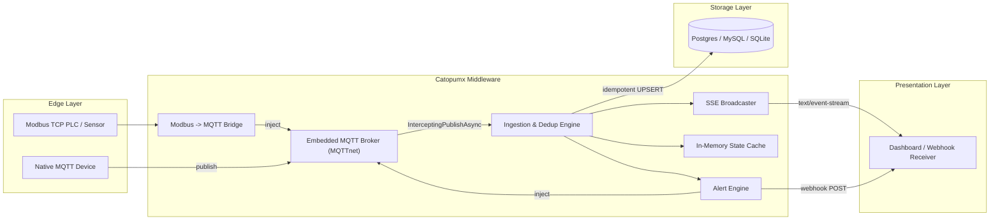

# Catopumx

**A single-binary, deterministic realtime hub for Industrial IoT (IIoT) — the C# / .NET port of [CatHub](https://github.com/dhimasarista/cathub).**

Catopumx collapses the typical IIoT ingestion stack — MQTT broker, worker, database, web server — into one process, so an edge gateway or small VPS can ingest, deduplicate, persist, and broadcast telemetry without an orchestration layer. It also bridges legacy Modbus TCP devices onto that same pipeline, so PLCs and sensors that don't speak MQTT natively don't need a separate gateway.

> **Project status: early / actively developed, ported from a working Rust reference implementation.** The core pipeline (MQTT ingest → dedup → vault → SSE → alerts) is implemented and covered by unit tests. It has not been run against real factory hardware or under production load.

## Why a C# port of a Rust project

This exists specifically to see how far C#'s managed-but-controllable runtime (`Span<T>`, `ConcurrentDictionary`, NativeAOT) gets for the same problem the original Rust project solves, without leaving the .NET/CORE ecosystem. See the [Tech Stack](#tech-stack) table for the exact library mapping.

## Architecture



Unlike the Rust original's in-process rumqttd "links", Catopumx's internal components talk to the embedded MQTT broker via `MqttServer.InterceptingPublishAsync` (inbound tap) and `MqttServer.InjectApplicationMessage` (outbound publish) — no loopback network connection to itself, but no true zero-copy in-process link either, since MQTTnet doesn't expose one. Functionally equivalent; worth knowing if you're comparing the two codebases line-for-line.

## Tech Stack

| Concern | Rust (CatHub) | C# (Catopumx) |
|---|---|---|
| HTTP server | `actix-web` | ASP.NET Core Minimal API |
| Async runtime | `tokio` | `Task`-based async/await |
| Embedded MQTT broker | `rumqttd` | `MQTTnet` |
| Modbus TCP client | `tokio-modbus` | `FluentModbus` |
| Database access | `sqlx::Any` (Postgres/MySQL/SQLite) | `Npgsql` / `MySqlConnector` / `Microsoft.Data.Sqlite` behind a small `Backend` abstraction |
| In-memory state cache | `dashmap` | `ConcurrentDictionary` (built-in) |
| Multi-consumer event broadcast | `tokio::sync::broadcast` | Custom `EventBus` (per-subscriber bounded `Channel<T>`, since .NET has no built-in broadcast channel) |
| Webhook dispatch | `ureq` | `HttpClient` (built-in) |
| Config | `dotenvy` (`.env`), `toml` (`catopumx.toml`) | Hand-rolled `.env` loader, `Tomlyn` (`catopumx.toml`) |
| Serialization | `serde` / `serde_json` | `System.Text.Json` (built-in) |
| Logging | `tracing` | `Microsoft.Extensions.Logging` (built-in) |

## Getting Started

### Prerequisites

- [.NET SDK](https://dotnet.microsoft.com/download) 10.0+
- Optionally, a Postgres, MySQL, or SQLite database if you want persistence instead of No-DB mode
- Optionally, a Modbus TCP device (or simulator) if you want to use the bridge

### Build & Run

```bash
git clone https://github.com/dhimasarista/Catopumx.git
cd Catopumx

# Copy the example environment file and adjust as needed
cp .env.example .env

# Optional: enable Modbus devices and/or alert rules
cp catopumx.toml.example catopumx.toml

# Run in debug mode
dotnet run

# Or build and run a release binary
dotnet build -c Release
dotnet bin/Release/net10.0/Catopumx.dll
```

On startup, Catopumx logs whether it connected to a database or is running in No-DB mode, how many Modbus devices and alert rules were loaded from `catopumx.toml`, then starts the MQTT broker (`MQTT_LISTEN_ADDR`) and the HTTP broadcaster (`http://0.0.0.0:3000`).

### Verify it's running

```bash
curl http://localhost:3000/health
# {"status":"ok","database":"No-DB Mode","modbus_devices":0,"alert_rules":0}
```

### Run the tests

```bash
cd Catopumx.Tests
dotnet test
```

## Configuration

Catopumx reads two files: `.env` for runtime/environment settings, and `catopumx.toml` (optional) for Modbus devices and alert rules. See [`.env.example`](.env.example) and [`catopumx.toml.example`](catopumx.toml.example) for the full, commented reference.

| Variable | Required | Default | Description |
|---|---|---|---|
| `DATABASE_URL` | No | *(unset)* | Postgres/MySQL/SQLite connection string. Omit to run in No-DB (broadcast-only) mode. |
| `MQTT_LISTEN_ADDR` | No | `0.0.0.0:1883` | Address the embedded MQTT broker listens on. |
| `MQTT_USERNAME` / `MQTT_PASSWORD` | No | *(unset)* | Credentials required from MQTT clients. Unset means unauthenticated. |
| `HTTP_LISTEN_ADDR` | No | `0.0.0.0:3000` | Address the HTTP broadcaster listens on. |

`catopumx.toml` has two top-level array sections, both optional and independent: `[[modbus]]` (Modbus TCP devices to poll and bridge onto MQTT) and `[[alerts]]` (threshold rules evaluated against ingested JSON payloads). Neither file is required to start Catopumx.

## API Reference

| Method | Path | Description |
|---|---|---|
| `GET` | `/health` | Process health, DB status, Modbus device count, alert rule count |
| `GET` | `/api/stream` | Server-Sent Events stream of every deduplicated ingested message |
| `GET` | `/api/state` | JSON snapshot of the latest value for every known topic |
| `GET` | `/api/state/{topic}` | Latest value for one topic (`404` if never seen) |

## Security posture (read before exposing beyond localhost)

Same known, deliberate gaps as the Rust original:

- **MQTT broker has no authentication unless you set it.** Set both `MQTT_USERNAME` and `MQTT_PASSWORD` before exposing `MQTT_LISTEN_ADDR` beyond localhost or a trusted network segment.
- **The HTTP API has no authentication at all.** It's read-only, but discloses every ingested topic's current value to anyone who can reach port 3000. Put it behind a reverse proxy with auth, or a network ACL.
- **The state cache caps topic handling** at 10,000 distinct topics, and topics longer than 255 bytes are rejected outright — a circuit breaker against an unauthenticated publisher exhausting memory with unique topics.
- **Webhook calls have a 10s timeout** and the configured URL is redacted before it's logged, but the URL/payload themselves aren't validated.
- **No TLS** on the MQTT broker or the HTTP server. Fine on a trusted LAN or behind a VPN; put a TLS-terminating proxy in front of both before crossing an untrusted network.

## Roadmap

- [ ] Per-topic dynamic schema inference (deliberately not implemented — same reasoning as the Rust original)
- [ ] Persistent (rather than reconnect-per-poll) Modbus TCP sessions for high-frequency polling
- [ ] MQTT wildcard (`+`/`#`) support in alert rule topic matching
- [ ] Historical time-series storage (currently only the *latest* value per topic is persisted)
- [ ] Integration tests against a real Modbus simulator and a real Postgres/MySQL instance
- [ ] CI workflow (`dotnet build`, `dotnet test`)
- [ ] Document deployment (systemd/Windows service or container image) for edge gateways

## Contributing

This project is in early, active development. Issues and pull requests are welcome via [GitHub](https://github.com/dhimasarista/Catopumx).

## License

No license has been declared for this project yet. All rights reserved by the author until a license is added.

---

*Built for the industrial edge — C# port of [CatHub](https://github.com/dhimasarista/cathub).*
